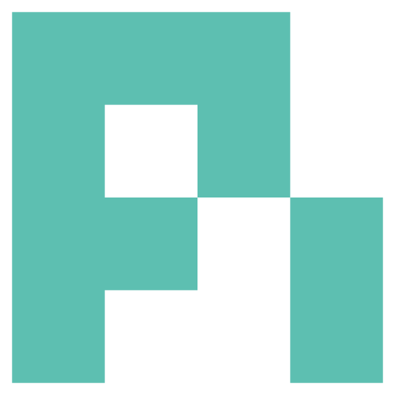
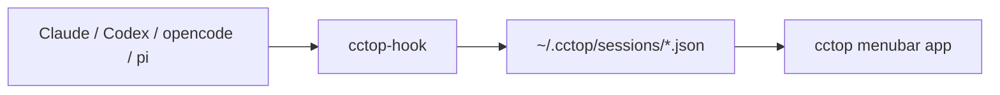

# cctop

<p>
  <a href="https://github.com/st0012/cctop/releases/latest">Latest release</a>
  &nbsp;|&nbsp;
  <a href="LICENSE">MIT license</a>
</p>

**Keep an eye on your AI coding sessions.**

See which session is waiting on you. Jump back to the right tab, pane, thread, or
project with a keystroke.

<p>
  <a href="https://github.com/st0012/cctop/releases/latest/download/cctop-macOS-arm64.dmg"><strong>Download for Apple Silicon</strong></a>
  &nbsp;|&nbsp;
  <a href="https://github.com/st0012/cctop/releases/latest/download/cctop-macOS-x86_64.dmg">Intel</a>
  &nbsp;|&nbsp;
  <a href="https://cctop.app">Website</a>
</p>

<p align="center">
  
  <br>
  <em>One compact menubar view for sessions across tools.</em>
  <br>
  <a href="https://github.com/st0012/cctop/releases/download/media-assets/cctop-launch.mp4">Full launch video (MP4)</a>
</p>

## Why cctop

- See at a glance which coding sessions are working, idle, or waiting on you.
- Jump directly to the right editor window, terminal pane, desktop thread, or project.
- Keep recent projects close without leaving a menubar app open all day.
- Store session state locally as plain JSON. No analytics, telemetry, or session upload.

## Works With Your Coding Tools

Each integration reports session events locally; cctop turns them into one menubar
view and a reliable jump target.

<table>
  <tr>
    <td align="center" width="25%">
      <a href="https://code.claude.com/docs">
        <br>
        <strong>Claude Code / Desktop</strong>
      </a>
      <br><sub>Claude plugin + event hooks</sub>
    </td>
    <td align="center" width="25%">
      <a href="https://developers.openai.com/codex">
        <br>
        <strong>Codex CLI / Desktop</strong>
      </a>
      <br><sub>Codex event hooks + trust step</sub>
    </td>
    <td align="center" width="25%">
      <a href="https://opencode.ai">
        <br>
        <strong>opencode</strong>
      </a>
      <br><sub>opencode plugin events</sub>
    </td>
    <td align="center" width="25%">
      <a href="https://pi.dev/">
        <br>
        <strong>pi</strong>
      </a>
      <br><sub>pi extension events</sub>
    </td>
  </tr>
</table>

## Jump Support

When you click a session card, or use Navigate mode, cctop tries to take you to
the most specific place it can.

- **Targets the exact session:** [iTerm2](https://iterm2.com/), [cmux](https://cmux.com/), [Kitty](https://sw.kovidgoyal.net/kitty/), [Ghostty](https://ghostty.org/), [Terminal](https://support.apple.com/guide/terminal/welcome/mac), [Codex Desktop](https://developers.openai.com/codex/app), [herdr](https://github.com/ogulcancelik/herdr), [Zellij](https://zellij.dev/), [tmux](https://tmux.us/). cctop jumps to the right window, tab, pane, surface, or desktop thread.
- **Opens the project:** [VS Code](https://code.visualstudio.com/), [Cursor](https://cursor.com/), [Windsurf](https://windsurf.com/download), [Zed](https://zed.dev/). cctop focuses the editor window, using the workspace file if present.
- **Activates the app:** [Claude Desktop](https://claude.com/download), [Warp](https://www.warp.dev/terminal). cctop raises the host app so you can find the tab manually.

<details>
<summary>Focus details and requirements</summary>

- iTerm2, Ghostty, and Apple Terminal require macOS Automation permission.
- Kitty targets the exact window when `allow_remote_control socket-only` and
  `listen_on` are enabled in `kitty.conf`; otherwise it falls back to app
  activation.
- cmux targets the exact workspace surface from stored metadata, and can recover
  live cmux metadata for already-running sessions.
- Ghostty requires version 1.3.0+ for AppleScript support. If the session TTY is
  unavailable, cctop falls back to working-directory matching.
- Apple Terminal targets the tab by tty. Inside a multiplexer such as tmux or
  screen, it falls back to raising Terminal because the captured tty belongs to
  the multiplexer pane.
- Other hosts fall back to opening the project folder in Finder.

</details>

## Designed For Scanning, Then Jumping

<table>
  <tr>
    <td width="42%">
      <h3>Navigate mode</h3>
      <p>Hit a global hotkey to overlay numbered badges on every session card, then press <kbd>1</kbd> to <kbd>9</kbd> to jump instantly.</p>
    </td>
    <td align="center">
      
    </td>
  </tr>
  <tr>
    <td width="42%">
      <h3>Draggable panel</h3>
      <p>Drag the header anywhere on screen. cctop remembers the position, and double-clicking snaps it back to the menubar anchor.</p>
    </td>
    <td align="center">
      
    </td>
  </tr>
  <tr>
    <td width="42%">
      <h3>Smart status icon</h3>
      <p>The menubar icon summarizes session health: healthy, needs attention, and a slim pill for laptops with a camera notch.</p>
    </td>
    <td align="center">
      
    </td>
  </tr>
  <tr>
    <td width="42%">
      <h3>Recent projects</h3>
      <p>A second tab keeps session history so you can reopen past projects without hunting through old terminals.</p>
    </td>
    <td align="center">
      
    </td>
  </tr>
</table>

## Install

### 1. Install the app

Download the latest signed and notarized build:

- [Apple Silicon](https://github.com/st0012/cctop/releases/latest/download/cctop-macOS-arm64.dmg)
- [Intel](https://github.com/st0012/cctop/releases/latest/download/cctop-macOS-x86_64.dmg)

Or use Homebrew:

```bash
brew install --cask st0012/cctop/cctop
```

cctop runs on macOS 13+. Signed release builds can check for updates through
Sparkle.

### 2. Connect your tools

Open **Settings > Tools**. cctop shows the setup action for each detected tool:

- Claude Code / Claude Desktop: click **Copy Install Command**, then run the
  two commands below in a terminal.
- opencode and pi: click **Install Plugin**.
- Codex CLI / Codex Desktop: click **Install Hooks**, then start a new Codex CLI
  session and choose **Trust all and continue** when Codex reviews the hooks.
  Codex Desktop shares that trust state.

Claude setup:

```bash
claude plugin marketplace add st0012/cctop
```

Then install the plugin:

```bash
claude plugin install cctop
```

Restart any running sessions to pick up newly installed hooks or plugins.

## Themes

Four palettes inspired by developer tools, each with light and dark variants.
Switch themes in **Settings > Appearance > Color**.

<table>
  <tr>
    <th align="center">Claude</th>
    <th align="center">Tokyo Night</th>
    <th align="center">Gruvbox</th>
    <th align="center">Nord</th>
  </tr>
  <tr>
    <td align="center">
      
    </td>
    <td align="center">
      
    </td>
    <td align="center">
      
    </td>
    <td align="center">
      
    </td>
  </tr>
</table>

## Privacy

**No analytics, no telemetry, and no session upload.** Session data stays on your
machine in `~/.cctop/sessions/` as plain JSON.

Signed release builds use network access only for Sparkle update checks and
downloads.

<details>
<summary>What cctop stores locally</summary>

- Session status, such as idle, working, or waiting.
- Project directory name.
- Last activity timestamp.
- Current tool or prompt context.

Inspect the files anytime:

```bash
ls ~/.cctop/sessions/
cat ~/.cctop/sessions/*.json | python3 -m json.tool
```

The session-file fields are documented in
[`docs/session-files.md`](docs/session-files.md).

</details>

## FAQ

<details>
<summary>Does cctop slow down my coding tool?</summary>

No. Each integration calls the lightweight native helper (`cctop-hook`) on
session events, writes a small JSON file, and returns immediately.

</details>

<details>
<summary>Do I need to configure anything per project?</summary>

No. Once your tools are connected, new sessions are automatically tracked.

</details>

<details>
<summary>How does cctop name sessions?</summary>

By default, cctop uses the project directory name. In Claude Code, you can rename
a session with `/rename` and cctop picks that up.

</details>

<details>
<summary>No sessions are showing up. What do I check?</summary>

First, restart sessions after installing the plugin or hooks. Then check whether
session files exist:

```bash
ls ~/.cctop/sessions/
```

If the directory is empty, the integration is not writing data yet. If files
exist but the menubar shows nothing, check whether those JSON files have
`"hidden": true`, then try restarting cctop.

</details>

<details>
<summary>Why does Codex Desktop need an extra trust step?</summary>

Codex only runs hooks you have explicitly reviewed and trusted. cctop can
install the hooks, but Codex Desktop does not currently surface the hook-review
prompt. Start one Codex CLI session in a terminal and trust the hooks there;
Codex Desktop shares that trust state.

</details>

<details>
<summary>What happens if a coding tool crashes?</summary>

cctop detects dead sessions automatically by checking whether each session's
process is still running, then removes stale entries.

</details>

<details>
<summary>Why does the app need to live in /Applications?</summary>

Plugins look for `cctop-hook` inside `/Applications/cctop.app`,
`~/Applications/cctop.app`, or `~/.cctop/bin/`. Installing elsewhere breaks the
hook path.

</details>

<details>
<summary>I am on an Intel Mac and the updater installed the wrong architecture.</summary>

cctop releases up to and including v0.15.2 shipped an appcast that confused
Sparkle's update picker, so Intel Macs could receive the Apple Silicon build.
The fix is in place going forward, but installed copies of cctop v0.15.2 and
older may need one manual replacement:

1. Quit cctop.
2. Download [`cctop-macOS-x86_64.dmg`](https://github.com/st0012/cctop/releases/latest/download/cctop-macOS-x86_64.dmg).
3. Drag the new `cctop.app` into `/Applications/`, replacing the existing one.
4. Relaunch cctop. Future updates will pick the correct architecture.

</details>

## Reference

<details>
<summary>How it works</summary>

All integrations call `cctop-hook`, a single native helper that owns session
state.



1. A tool plugin or hook translates client events into `cctop-hook` calls.
2. `cctop-hook` writes one small JSON file per session.
3. The menubar app watches `~/.cctop/sessions/` and renders live status.
4. pi skips non-interactive background sessions automatically.

</details>

<details>
<summary>Uninstall</summary>

```bash
# Remove the menubar app
rm -rf /Applications/cctop.app

# Remove the Claude Code / Claude Desktop plugin
claude plugin remove cctop
claude plugin marketplace remove cctop

# Remove the opencode plugin
rm ~/.config/opencode/plugins/cctop.js

# Remove the pi extension
rm ~/.pi/agent/extensions/cctop.ts

# Remove the Codex CLI / Codex Desktop hooks
rm ~/.codex/cctop-shim.sh
# Then remove cctop entries from ~/.codex/hooks.json

# Remove session data and config
rm -rf ~/.cctop
```

If installed via Homebrew:

```bash
brew uninstall --cask cctop
```

</details>

<details>
<summary>Build from source</summary>

Requires Xcode 16+ and macOS 13+.

```bash
git clone https://github.com/st0012/cctop.git
cd cctop
./scripts/bundle-macos.sh
cp -R dist/cctop.app /Applications/
open /Applications/cctop.app
```

</details>

## License

MIT
