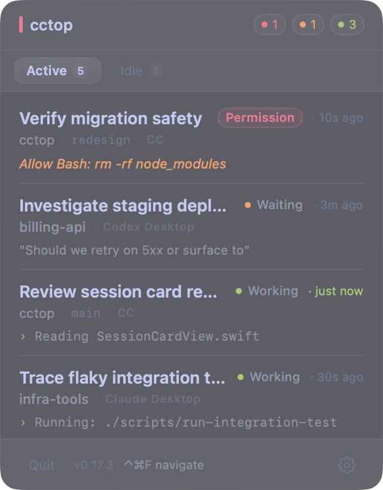
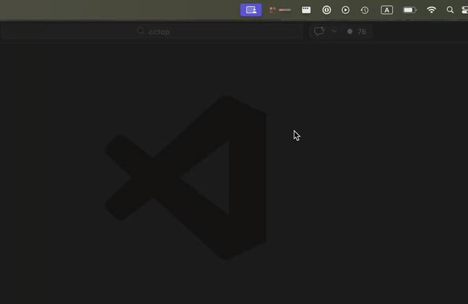

# cctop

[](https://github.com/st0012/cctop/releases/latest)
[](LICENSE)

**A keyboard-first menubar app to monitor and jump between AI coding sessions — minimum setup required.**

Works with your existing editor, terminal, and workflow.

<table align="center">
  <tr>
    <td align="center"></td>
    <td align="center"></td>
  </tr>
  <tr>
    <td align="center"><em>Tokyo Night (dark)</em></td>
    <td align="center"><em>Claude (light)</em></td>
  </tr>
</table>

## Features

**Draggable panel.** Drag the header to reposition the panel anywhere on screen — position persists across launches. Double-click the header to snap back to the default menubar anchor.

<p align="center">
  
</p>

**Navigate mode.** Hit a global hotkey to overlay numbered badges (1–9) on every session card, then press the number to jump instantly.

<p align="center">
  
  <br><em>Navigate mode — press 1–9 to jump</em>
</p>

**Recent Projects.** A second tab keeps session history so you can reopen past projects easily.

<p align="center">
  
  <br><em>Recent projects tab</em>
</p>

**Smart status icon.** See session health without opening the panel:

<p align="center">
  
</p>

### Supported Tools

| Tool | Status | How it connects |
|------|--------|-----------------|
| [Claude Code](https://docs.anthropic.com/en/docs/claude-code) | Supported | Shell hooks → `cctop-hook` CLI |
| [opencode](https://opencode.ai) | Supported | JS plugin → `cctop-hook` CLI |
| [pi](https://github.com/badlogic/pi-mono) | Supported | TS extension → `cctop-hook` CLI |
| [Codex CLI](https://github.com/openai/codex) | Supported | Shell hooks → `cctop-hook` CLI (requires `codex_hooks = true` feature flag) |

### Supported Editors & Terminals

When you click a session card (or jump via Navigate mode), cctop focuses the host app:

| App | Focus level |
|-----|-------------|
| VS Code, Cursor, Windsurf, Zed | Opens the project (workspace file if present) |
| iTerm2 | Targets the specific window, tab, and pane |
| Kitty | Targets the specific window via remote control |
| Ghostty | Targets a terminal whose working directory matches the project (best-effort) |
| Warp, Terminal | Activates the app (no per-tab targeting) |
| Other | Falls back to opening the project folder in Finder |

> [!NOTE]
> iTerm2 and Ghostty require macOS Automation permission. You'll be prompted to grant it on first use.
>
> Kitty requires `allow_remote_control socket-only` and `listen_on` in your `kitty.conf`.
> Without remote control enabled, Kitty falls back to app activation (same as Warp).
>
> Ghostty requires version 1.3.0+ for AppleScript support. Because Ghostty does not
> yet expose a per-surface env var inside the shell, cctop matches by working
> directory — ambiguous when multiple Ghostty splits share the same cwd.

### Terminal Multiplexers

When running inside a multiplexer, cctop additionally focuses the specific pane.
This composes with any terminal emulator above.

| Multiplexer | How it focuses |
|-------------|----------------|
| Zellij | `zellij --session <name> action focus-pane-id <paneId>` — targets the exact pane |
| tmux | `tmux select-window` + `select-pane` — targets the exact window and pane |

## Installation

### Step 1: Install the app

**Download:** [Apple Silicon](https://github.com/st0012/cctop/releases/latest/download/cctop-macOS-arm64.dmg) | [Intel](https://github.com/st0012/cctop/releases/latest/download/cctop-macOS-x86_64.dmg)

Once installed, cctop updates itself automatically via Sparkle. You'll be prompted when a new version is available.

<details>
<summary>Alternative: Homebrew</summary>

```bash
brew install --cask st0012/cctop/cctop
```

</details>

### Step 2: Connect your tools

Follow the app's instructions to connect your tools. The app auto-detects installed tools and offers one-click plugin installation.

## Themes

Four color schemes inspired by beloved developer tools — each with dark and light variants.

| Claude | Tokyo Night | Gruvbox | Nord |
|:------:|:-----------:|:-------:|:----:|
|  |  |  |  |

Switch themes in Settings > Appearance > Color.

## Privacy

**No network access. No analytics. No telemetry. All data stays on your machine.**

cctop stores only:

- Session status (idle / working / waiting)
- Project directory name
- Last activity timestamp
- Current tool or prompt context

This data lives in `~/.cctop/sessions/` as plain JSON files. You can inspect it anytime:

```bash
ls ~/.cctop/sessions/
cat ~/.cctop/sessions/*.json | python3 -m json.tool
```

## FAQ

**Does cctop slow down my coding tool?**
No. The plugin calls a lightweight native binary (`cctop-hook`) on each event, which writes a small JSON file and returns immediately. There is no measurable impact on performance.

**Do I need to configure anything per project?**
No. Once the plugin is installed, all sessions are automatically tracked. No per-project setup required.

**How does cctop name sessions?**
By default, the project directory name (e.g. `/path/to/my-app` shows as "my-app"). In Claude Code, you can rename a session with `/rename` and cctop picks that up.

**No sessions are showing up — what do I check?**
First, make sure you restarted sessions after installing the plugin. Then check if session files exist: `ls ~/.cctop/sessions/`. If the directory is empty, the plugin isn't writing data — verify it's installed correctly (see Step 2). If files exist but the menubar shows nothing, try restarting the cctop app.

**What happens if a coding tool crashes?**
cctop detects dead sessions automatically. It checks whether each session's process is still running and removes stale entries. No manual cleanup needed.

**Why does the app need to be in /Applications/?**
All plugins look for `cctop-hook` inside `/Applications/cctop.app` or `~/.cctop/bin/`. Installing elsewhere breaks the hook path.

**I'm on an Intel Mac and the in-app updater installed the wrong architecture.**
cctop releases up to and including v0.15.2 shipped an appcast that confused Sparkle's update picker, so Intel Macs could receive the Apple Silicon build. The structural fix is in place going forward, but the Sparkle framework already bundled inside any installed copy of cctop ≤ 0.15.2 doesn't know about the new appcast hints. To get back on the upgrade path, manually download the Intel build once:

1. Quit cctop.
2. Download [`cctop-macOS-x86_64.dmg`](https://github.com/st0012/cctop/releases/latest/download/cctop-macOS-x86_64.dmg).
3. Drag the new `cctop.app` into `/Applications/`, replacing the existing one.
4. Relaunch cctop. Future updates will pick the correct architecture automatically.

## Uninstall

```bash
# Remove the menubar app
rm -rf /Applications/cctop.app

# Remove the Claude Code plugin
claude plugin remove cctop
claude plugin marketplace remove cctop

# Remove the opencode plugin
rm ~/.config/opencode/plugins/cctop.js

# Remove the pi extension
rm ~/.pi/agent/extensions/cctop.ts

# Remove the Codex CLI plugin
rm ~/.codex/cctop-shim.sh
# Then remove cctop entries from ~/.codex/hooks.json (or delete it if cctop was the only user)

# Remove session data and config
rm -rf ~/.cctop
```

If installed via Homebrew: `brew uninstall --cask cctop`

<details>
<summary>How it works</summary>

All tools go through `cctop-hook` — a single native binary that manages all session state.

```
┌─────────────┐    hook fires     ┌────────────┐
│ Claude Code │ ────────────────> │ cctop-hook │ ──┐
│             │  SessionStart,    │  (Swift)   │   │
└─────────────┘  Stop, PreTool,…  └────────────┘   │
                                       ▲           │  writes JSON
┌─────────────┐   plugin event    ┌────┴───────┐   │  per-session
│  opencode   │ ────────────────> │ JS plugin  │   │
└─────────────┘  session.status,  │ (calls     │   │
                 tool.execute,…   │  cctop-hook│   │
┌─────────────┐                   └────────────┘   │
│     pi      │ ────────────────> ┌────────────┐   │
└─────────────┘  session_start,   │ TS ext     │ ──┤
                 tool_exec,…      │ (calls     │   ▼
                                  │  cctop-hook│  ┌───────────────────┐
                                  └────────────┘  │ ~/.cctop/sessions │
                                                  │   ├── 123.json    │
                                                  │   └── 456.json    │
                                                  └──────────┬────────┘
                                                             │ file watcher
                                                             ▼
                                                  ┌──────────────┐
                                                  │ Menubar app  │
                                                  │ (live status)│
                                                  └──────────────┘
```

1. Each tool has a thin plugin that translates events into `cctop-hook` calls
2. `cctop-hook` (Swift CLI) handles all session state and writes to `~/.cctop/sessions/`
3. The menubar app watches this directory and displays live status
4. **pi**: non-interactive sessions (background agents) are automatically skipped

</details>

<details>
<summary>Build from source</summary>

Requires Xcode 16+ and macOS 13+.

```bash
git clone https://github.com/st0012/cctop.git
cd cctop
./scripts/bundle-macos.sh
cp -R dist/cctop.app /Applications/
open /Applications/cctop.app
```

</details>

## License

MIT
