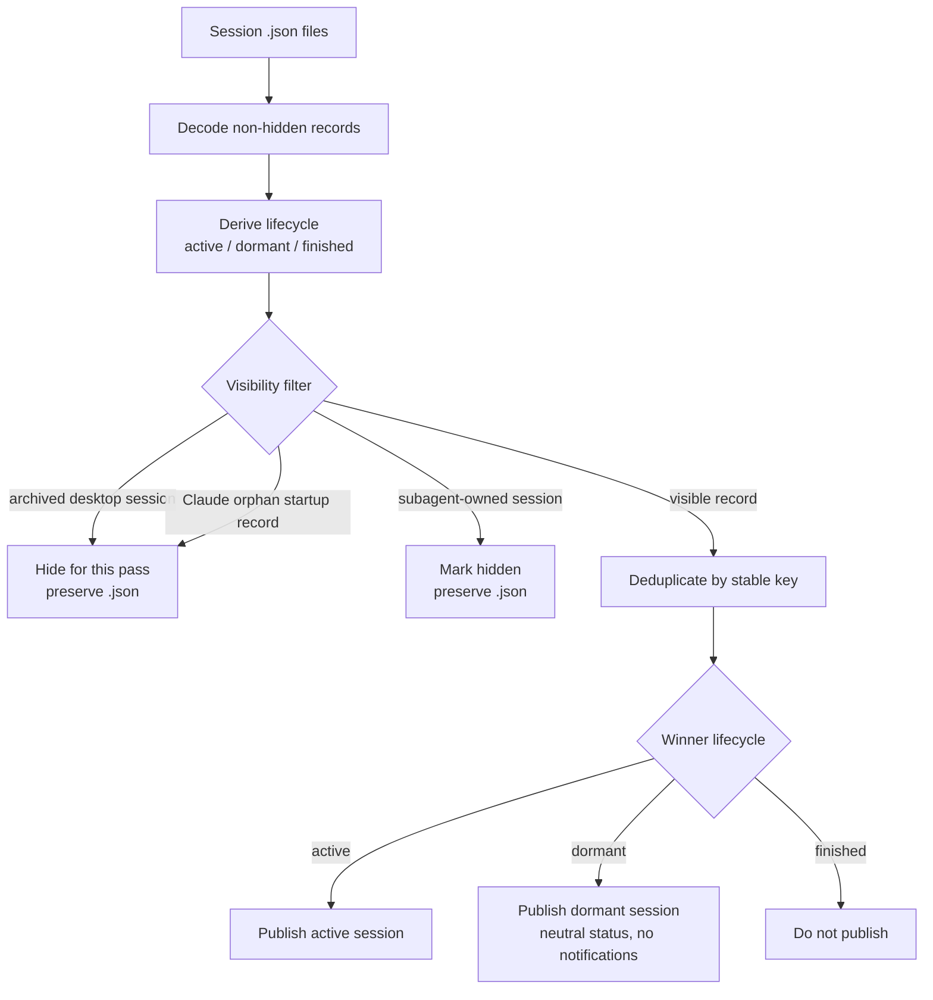
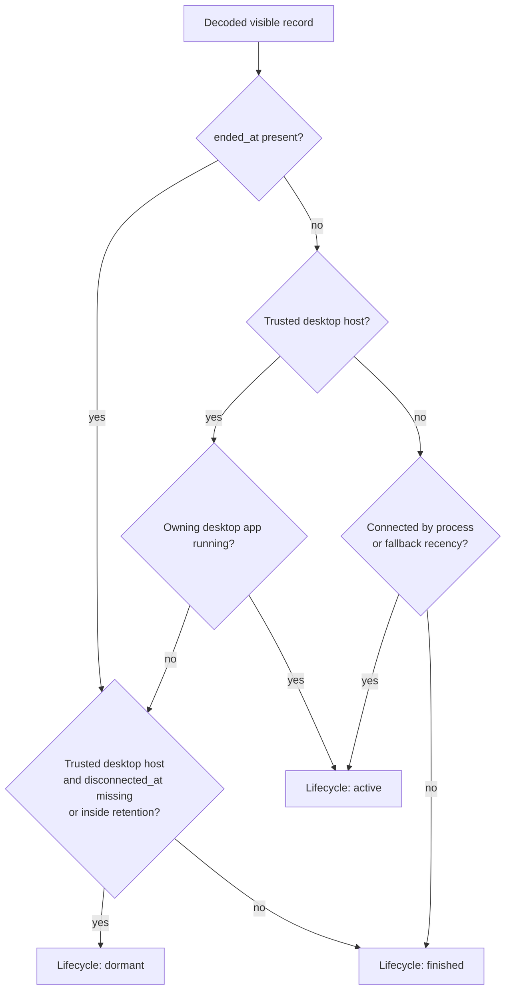
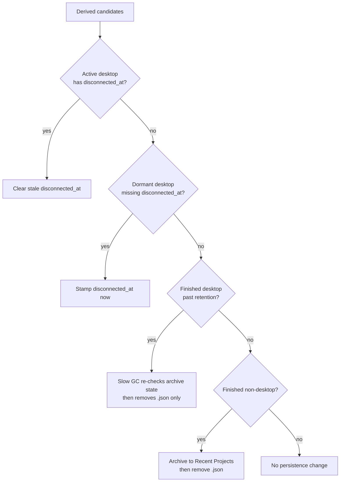

# Session Lifecycle

This flow documents how cctop turns a session file into one display-time lifecycle:
`active`, `dormant`, or `finished`. The desktop path applies to both Claude Desktop and Codex Desktop.

The key split is intentional:

- File presence means cctop has a record to evaluate. It is not itself proof that the session is live.
- Visibility filters decide whether a decoded record can be displayed at all.
- Connection evidence decides whether the host is connected right now.
- Lifecycle decides how cctop should treat a visible record.
- Persistence actions update `disconnected_at`, remove stale files, or archive finished CLI work.
- `disconnected_at` is the retention clock for known desktop sessions, including Claude Desktop and Codex Desktop, that have become dormant.
- CLI and ambiguous sessions do not use dormant retention. Once disconnected, they become finished.

## Display Pipeline

## Lifecycle Derivation

## Persistence Actions

## Field Meanings

### `ended_at`

`ended_at` is set when a hook observes `SessionEnd`. It is an explicit disconnect signal for every host class.

For trusted desktop records, `ended_at` still wins over app-level liveness. A running desktop app keeps non-ended visible records active, but it does not make an older ended hook record active again.

New activity clears `ended_at` so a resumed session can become connected again.

### `disconnected_at`

`disconnected_at` is only meaningful for known desktop sessions, currently Claude Desktop and Codex Desktop. It starts the dormant retention window.

It can be set in two ways:

- A desktop `SessionEnd` stamps it at the same time as `ended_at`.
- The menubar app stamps it when it first observes a known desktop session as dormant and the field is missing.

The menubar app clears it when the same trusted desktop app is observed running again and the session has not explicitly ended.

CLI sessions do not need `disconnected_at` because disconnected CLI sessions become finished immediately.

## Dedup and Cleanup

Session files are deduplicated by a stable identity key before publishing. `SessionIdentityPolicy` owns that grouping rule. Codex sessions use `session_id` across both old PID-keyed files and newer `codex-<session_id>` files. Known desktop sessions also use `session_id`; other terminal or ambiguous sessions keep PID identity.

Archived desktop sessions are filtered from the active/dormant list before dedup and cleanup. cctop does not persist `hidden = true` for this case and does not remove the `.json`, so a later app-level unarchive can make the same session file visible again. The slow GC re-reads desktop archive state at the per-file deletion decision rather than from the pass-level snapshot, so a session archived mid-pass is never reaped out from under a pending unarchive.

Subagent-owned sessions are filtered before dedup and cleanup, then persisted as `hidden = true`. Any client can mark a session file with `is_subagent = true`; Codex sessions also inherit that marker from Codex's local thread database when `thread_source = 'subagent'`. The parent session's `active_subagents` list remains visible, because it describes delegated work owned by the user-facing session rather than making the parent itself a subagent.

Finished terminal or ambiguous sessions that survive dedup are archived to Recent Projects and then removed. Finished non-desktop duplicates that lose dedup are migration debris, so cctop removes their stale `.json` files without archiving them as separate recent sessions.

`SessionLifecyclePolicy` owns the derived state question: whether the record is connected, and whether a disconnected record should be active, dormant, or finished for its host class. The lifecycle remains display-time state only; it is not persisted to the session file.

## Desktop Host Coverage

Claude Desktop and Codex Desktop both enter the desktop lifecycle path only through trusted bundle IDs:

- Claude Desktop: `com.anthropic.claudefordesktop`
- Codex Desktop: `com.openai.codex`

Once a validated desktop app is not running, cctop keeps its visible sessions as dormant while `disconnected_at` is inside the retention window, then the slow GC removes stale `.json` files. When that desktop app is running again, its visible sessions are active display records, so their stored status can render as Idle, Working, Compacting, Waiting, Permission, or Attention instead of Dormant.

The archive metadata source is host-specific:

- Claude Desktop archive state is read from Claude Desktop's `claude-code-sessions` metadata files, keyed by `cliSessionId`.
- Codex Desktop archive state starts from Codex's local thread state, keyed by thread id. When that row includes a rollout path, cctop checks the active and archived rollout-file locations; if exactly one exists, file placement is treated as the stronger archive signal. If placement is ambiguous or unavailable, cctop falls back to the thread-state archive flag.

Codex thread state may live in more than one `state_5.sqlite` location. cctop first asks the running Codex Desktop app-server for its SQLite home, then falls back to Codex config and static `CODEX_HOME` paths. cctop does not trust its own `CODEX_SQLITE_HOME` environment variable for this decision, because normal Finder, Dock, and Sparkle launches do not inherit the shell environment that started cctop during development.

Claude Desktop records are validated against readable Claude metadata keyed by `cliSessionId`. If the metadata store is readable but has no matching metadata and the cctop record has already ended or disconnected, cctop treats it as an orphan startup hook record and hides it without mutating or deleting the `.json`. This covers launch-time records that start and end before Claude Desktop writes durable session metadata. If the metadata store is missing, display fails open and the record follows the normal lifecycle. If matching metadata cannot be read, display fails open for that pass while GC keeps the `.json` rather than deleting uncertain state.

The active liveness evidence is layered:

- Claude Desktop and Codex Desktop use app-level bundle liveness when the bundle is known.
- If app-level liveness is not available, Codex Desktop falls back to recent hook activity instead of PID liveness, because Codex Desktop can report multiple conversations from a shared host process.
- Non-desktop sessions keep using their own process liveness and terminal-style cleanup.

Both hosts still use the same disconnected-state policy after the shared connection step.

## Why This Shape

The connection state is shared across host classes, but host policy differs:

- Desktop disconnection may be temporary because Claude Desktop or Codex Desktop can close or update while conversations still exist inside the app.
- CLI disconnection means the process is gone or the hook explicitly ended the session, so the old archive/remove behavior remains correct.
