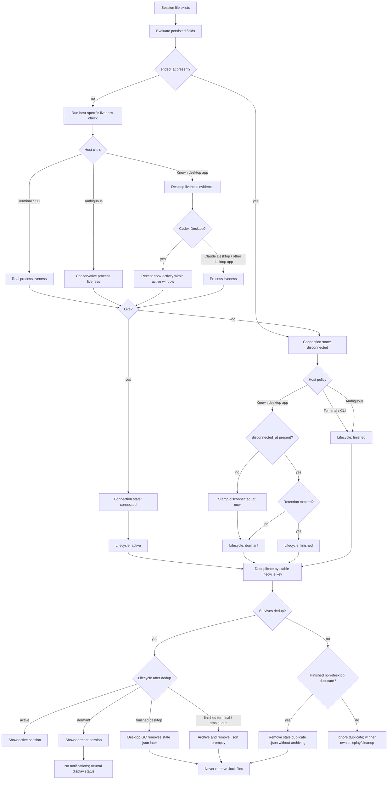

# Session Lifecycle

This flow documents how cctop turns a session file into a connection state and then into a UI/cleanup lifecycle.
The desktop path applies to both Claude Desktop and Codex Desktop.

The key split is intentional:

- File presence means cctop has a record to evaluate. It is not itself proof that the session is live.
- `ended_at` is an explicit disconnect signal written by hook events.
- `disconnected_at` is the retention clock for known desktop sessions, including Claude Desktop and Codex Desktop, that have become dormant.
- CLI and ambiguous sessions do not use dormant retention. Once disconnected, they become finished.

## Field Meanings

### `ended_at`

`ended_at` is set when a hook observes `SessionEnd`. It is read before any PID or recency check. If it is present, every host class is considered disconnected.

New activity clears `ended_at` so a resumed session can become connected again.

### `disconnected_at`

`disconnected_at` is only meaningful for known desktop sessions, currently Claude Desktop and Codex Desktop. It starts the dormant retention window.

It can be set in two ways:

- A desktop `SessionEnd` stamps it at the same time as `ended_at`.
- The menubar app stamps it when it first observes a known desktop session as dormant and the field is missing.

CLI sessions do not need `disconnected_at` because disconnected CLI sessions become finished immediately.

## Dedup and Cleanup

Session files are deduplicated by a stable identity key before publishing. `SessionIdentityPolicy` owns that grouping rule. Codex sessions use `session_id` across both old PID-keyed files and newer `codex-<session_id>` files. Known desktop sessions also use `session_id`; other terminal or ambiguous sessions keep PID identity.

Finished terminal or ambiguous sessions that survive dedup are archived to Recent Projects and then removed. Finished non-desktop duplicates that lose dedup are migration debris, so cctop removes their stale `.json` files without archiving them as separate recent sessions.

`SessionLifecyclePolicy` owns the derived state question: whether the record is connected, and whether a disconnected record should be active, dormant, or finished for its host class. The lifecycle remains display-time state only; it is not persisted to the session file.

## Desktop Host Coverage

Claude Desktop and Codex Desktop both enter the desktop lifecycle path only through trusted bundle IDs:

- Claude Desktop: `com.anthropic.claudefordesktop`
- Codex Desktop: `com.openai.codex`

Once either host is disconnected, the behavior is the same: cctop keeps the session as dormant while `disconnected_at` is inside the retention window, then the slow GC removes the stale `.json` file.

The active liveness evidence is not identical:

- Claude Desktop uses the normal process liveness check unless `ended_at` is present.
- Codex Desktop uses recent hook activity instead of PID liveness, because Codex Desktop can report multiple conversations from a shared host process.

Both hosts still use the same disconnected-state policy after the shared connection step.

## Why This Shape

The connection state is shared across host classes, but host policy differs:

- Desktop disconnection may be temporary because Claude Desktop or Codex Desktop can close or update while conversations still exist inside the app.
- CLI disconnection means the process is gone or the hook explicitly ended the session, so the old archive/remove behavior remains correct.
